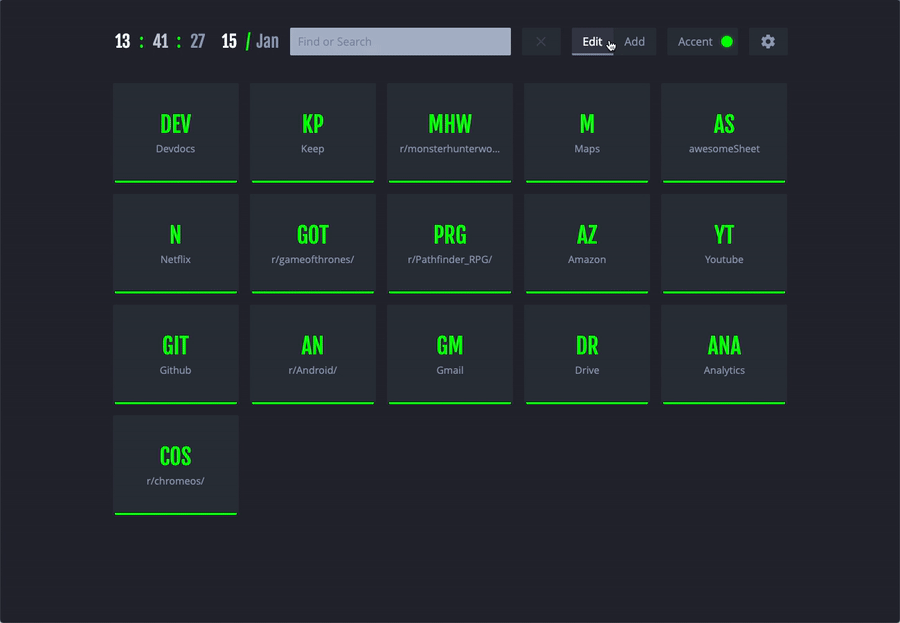
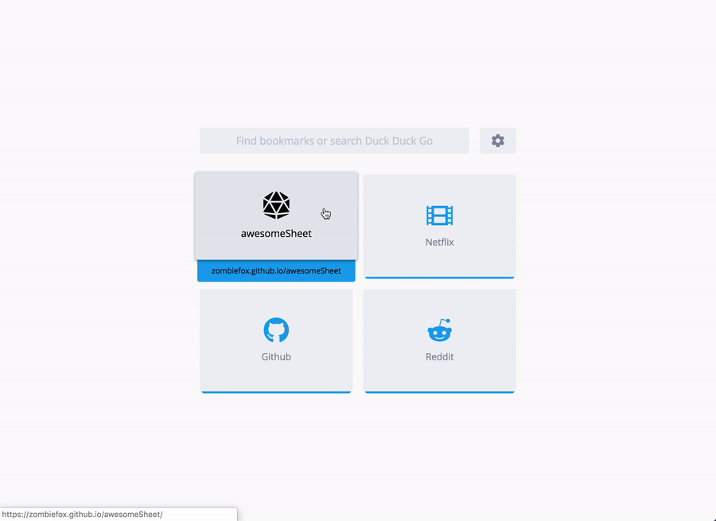
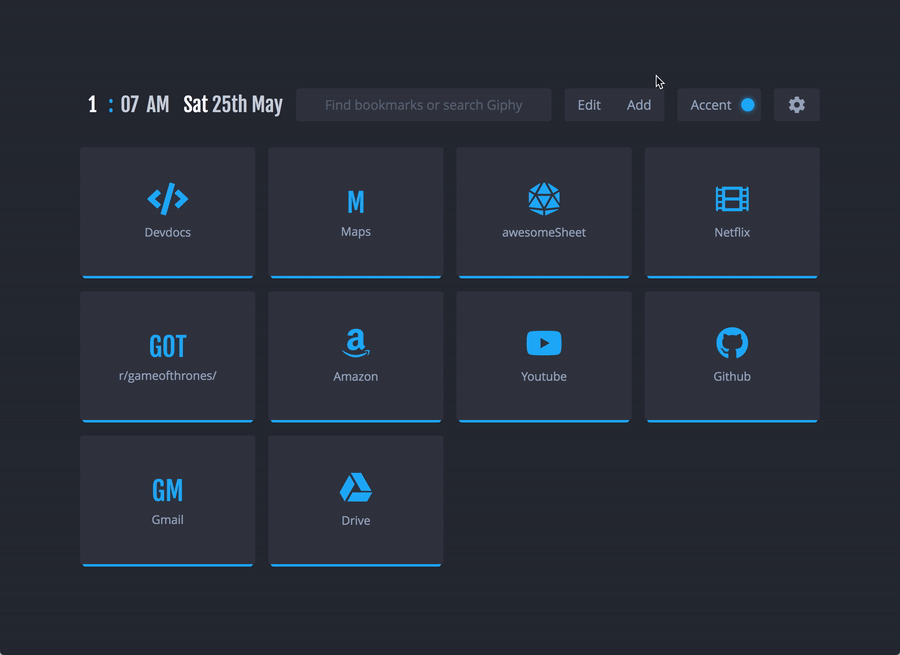
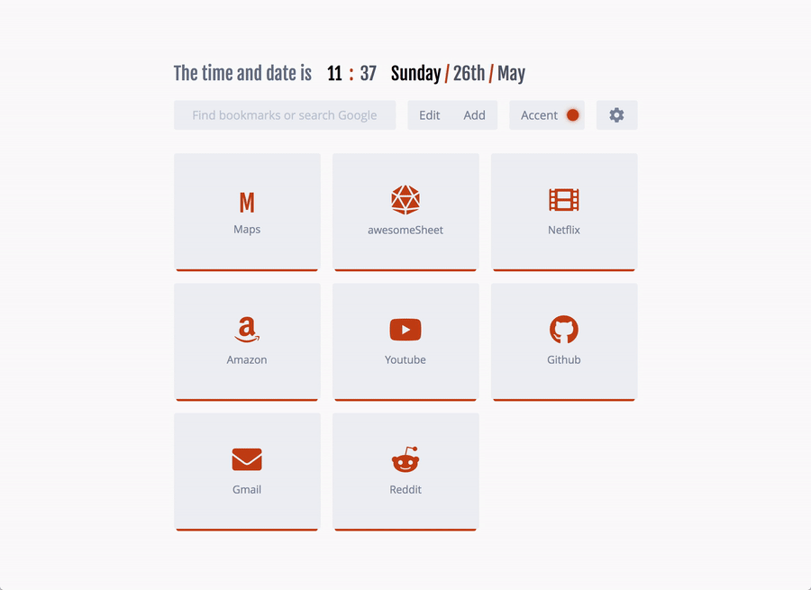
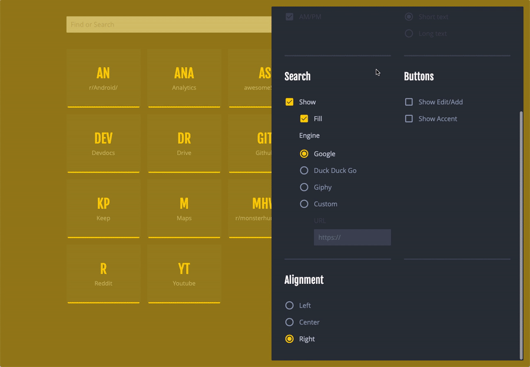

# nightTab
New-tab-page/Start-page for all browsers

## [See it in action](https://zombiefox.github.io/nightTab/)

### Features
- Add and remove bookmarks
- Filter bookmarks with keyword
- Clock for awesome clocky action!
- Date too because time is difficult
- Search bar to find bookmarks
- Search bar again but this time with options to customise the search engine
- Saves data to local storage
- Keyboard shortcuts
  - esc to dismiss most things
  - <kbd>ctrl</kbd>+<kbd>alt</kbd>+<kbd>a</kbd> *to add a new bookmark*
  - <kbd>ctrl</kbd>+<kbd>alt</kbd>+<kbd>m</kbd> *to open menu*
  - <kbd>ctrl</kbd>+<kbd>alt</kbd>+<kbd>e</kbd> *to toggle edit state*
  - <kbd>ctrl</kbd>+<kbd>alt</kbd>+<kbd>r</kbd> *random theme if option is turned on in menu > layout > random Accent colour*
- Responsive design
- Customise Accent colour!
- Can be installed on Chrome as an extension

All options available:
- Header
  - Clock, hours, minutes, seconds, 24 hours, separators
  - Date, day, month, year, separators, text length
  - Search, bar length, search engine
  - Show/hide Edit/Add and Accent buttons
  - Header alignment
- Bookmarks
  - Open in a new tab
  - Block and List style
  - Sort by Name, Letter or order added
- Layout
  - Fluid, Wide or Thin
  - Scroll past end of page
  - Random theme colour

---

