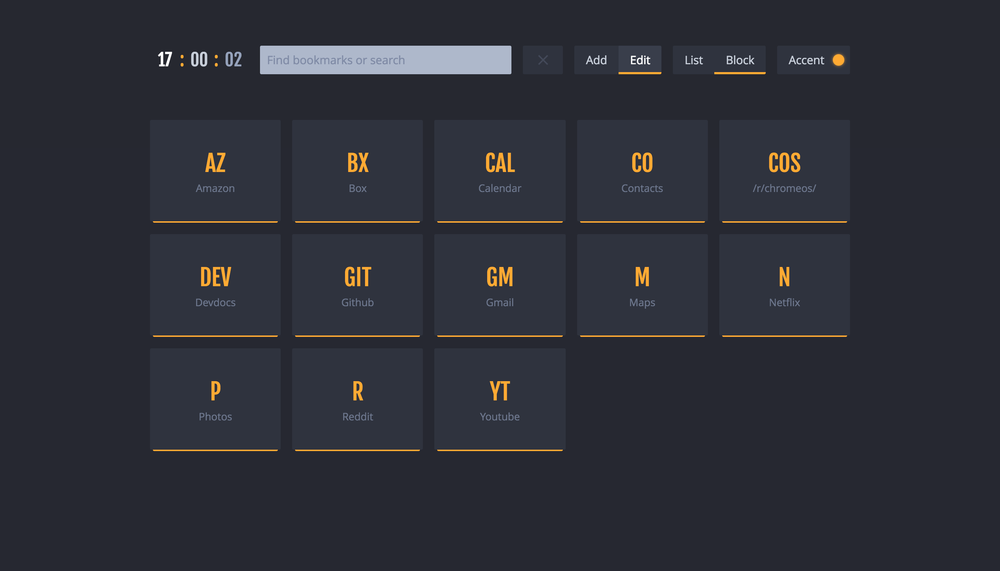
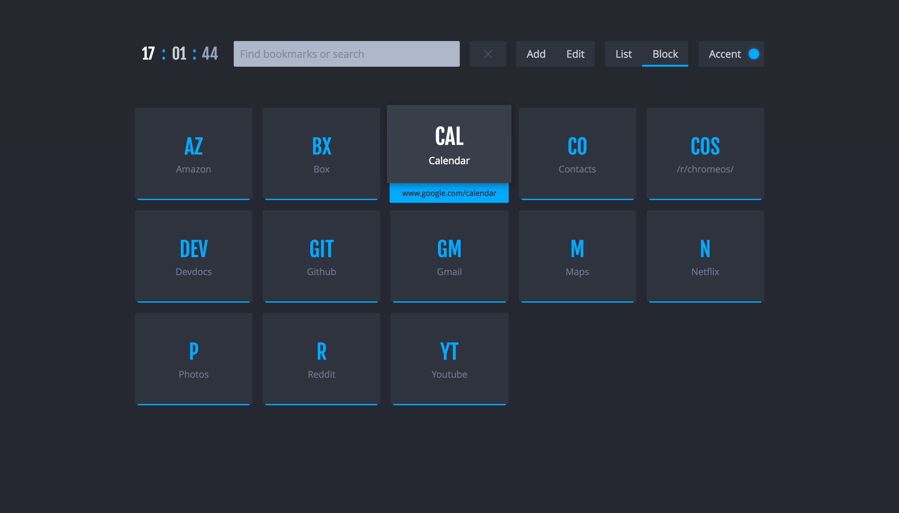
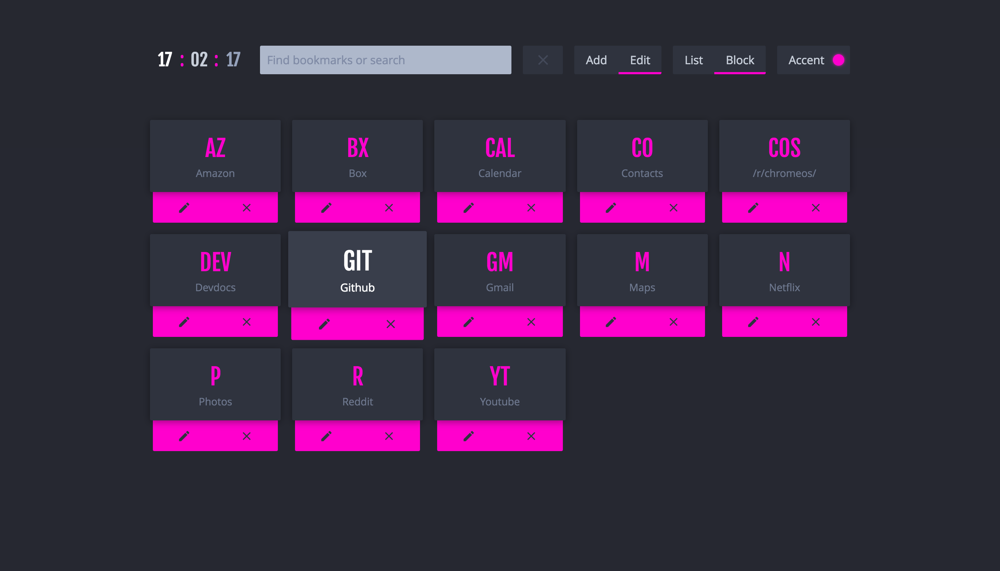
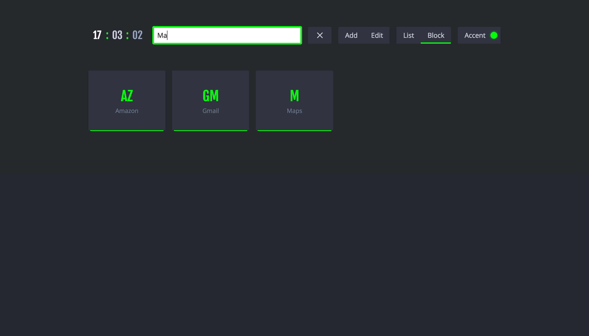
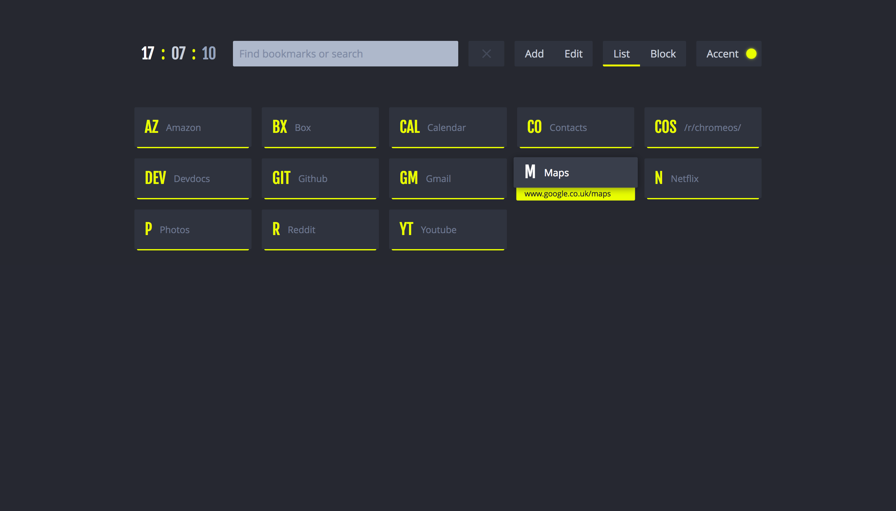

# nightTab
New-tab-page/Start-page for all browsers

## [See it in action](https://zombiefox.github.io/nightTab/)

### Features
- Add and remove bookmarks
- Filter bookmarks with keyword
- Clock for awesome clocky action!
- Search bar
- Saves data to local storage
- Responsive design
- Customise theme colour
- Can be installed on Chrome as an extension
- Switch between Block and List bookmark view

---

