# NIGHTTAB
A neutral new tab page accented with a chosen colour. Customise the layout, style, background and bookmarks in nightTab -- a custom start page.

[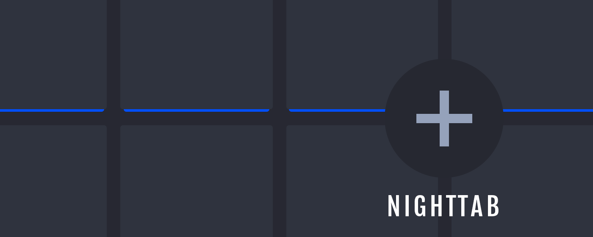](https://zombiefox.github.io/nightTab/)

| [See the demo in action](https://zombiefox.github.io/nightTab/) | [Install nightTab Extension](https://chrome.google.com/webstore/detail/nighttab/hdpcadigjkbcpnlcpbcohpafiaefanki) | [Install nightTab Add On](https://addons.mozilla.org/en-GB/firefox/addon/nighttab/) | [Buy me a coffee](https://www.buymeacoffee.com/zombieFox/) |
|:-------------:|:-------------:|:-------------:|:-------------:|
|  |  |  |  |

---

### Features
- Header
  - Greeting
    - Name, Style, Size
  - Clock
    - Hours, Minutes, Seconds, Separator, Meridiem, Hour/24, Size
  - Date
    - Day, Date, Month, Year, Separator, D/M or M/D format, Size
  - Search
    - Filter, Search engine, Size
  - Add and remove, Accent
- Bookmarks
  - Drag and drop sort, sort by Letter, Icon, Name
  - Letter or icon, Names, URLs, Open in new tab, Size
- Layout
  - Vertical and horizontal alignment, Padding, Gutter, Width, Title
- Theme
  - Accent colour, Random accent colour, Light/Dark theme, Radius
- Background
  - Image, Blur, Scale, Opacity, Grayscale, Accent colour
- Saves data to local storage
- Keyboard shortcuts
  - <kbd>esc</kbd> *to dismiss most things*
  - <kbd>ctrl</kbd>+<kbd>alt</kbd>+<kbd>a</kbd> *to add a new bookmark*
  - <kbd>ctrl</kbd>+<kbd>alt</kbd>+<kbd>g</kbd> *to add a new group*
  - <kbd>ctrl</kbd>+<kbd>alt</kbd>+<kbd>m</kbd> *to open menu*
  - <kbd>ctrl</kbd>+<kbd>alt</kbd>+<kbd>e</kbd> *to toggle edit state*
  - <kbd>ctrl</kbd>+<kbd>alt</kbd>+<kbd>d</kbd> *to toggle dark and light mode*
  - <kbd>ctrl</kbd>+<kbd>alt</kbd>+<kbd>r</kbd> *random theme if option is turned on in* `menu > layout > random Accent colour`
- Responsive design

---

### Wiki

- [Recovering user settings and bookmarks](https://github.com/zombieFox/nightTab/wiki/Recovering-user-settings-and-bookmarks)
- [Setting nightTab as your Firefox homepage](https://github.com/zombieFox/nightTab/wiki/Setting-nightTab-as-your-Firefox-homepage)

---

### Development

When developing use:
- `npm run dev`

A Development copy will be created in `/dev/`. Open `/dev/index.html` in a browser to test. Make changes to files in the `/src/` directory and refresh browser to see changes.

To build the project use:
- `npm run build`

A web ready folder will be created in `/build/web/`.
A browser addon/extension ready zip will be created in `/build/extension/`.

---

### Sync data for backup and multiple device use

There's an [experimental sync server](https://github.com/deanbarrow/nightTab-sync-server) which you can self host and will allow you to backup and restore across multiple devices.

---

[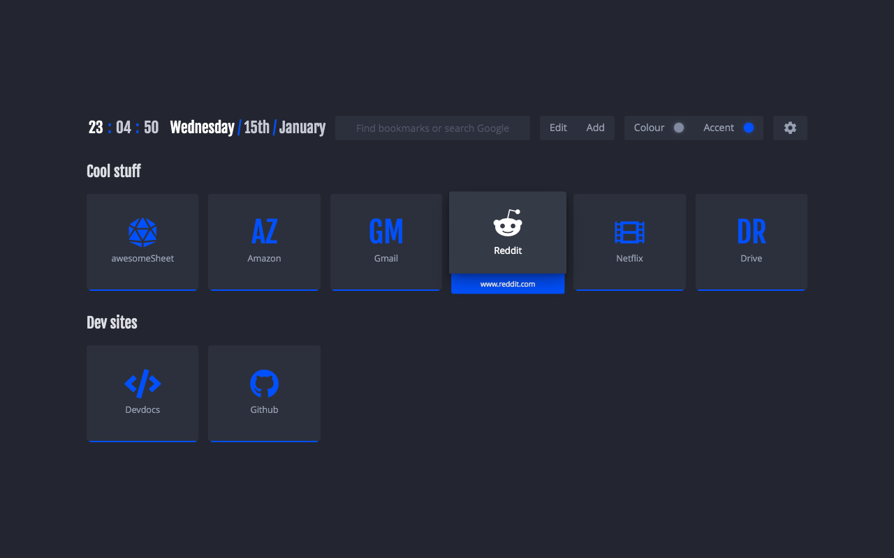](https://zombiefox.github.io/nightTab/)
[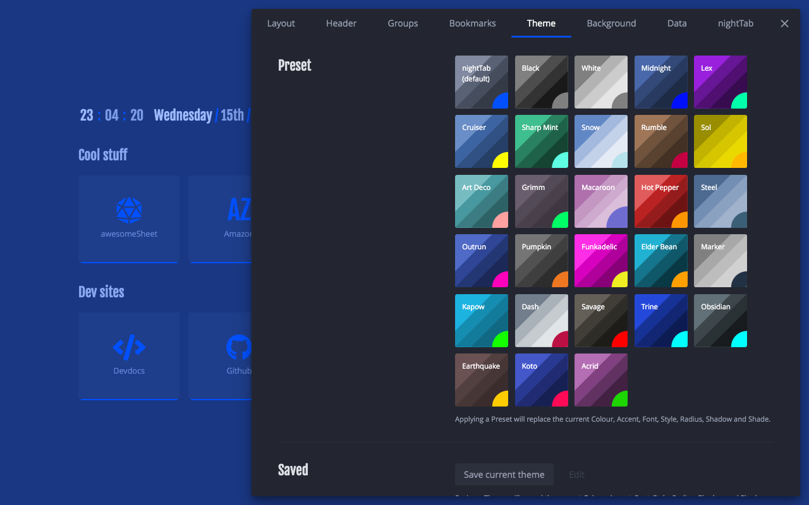](https://zombiefox.github.io/nightTab/)
[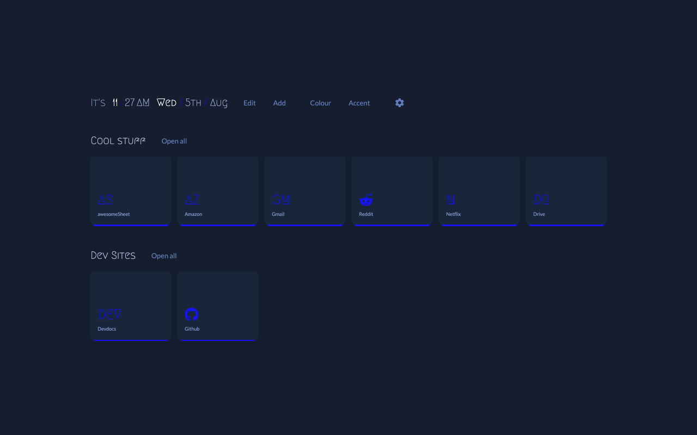](https://zombiefox.github.io/nightTab/)
[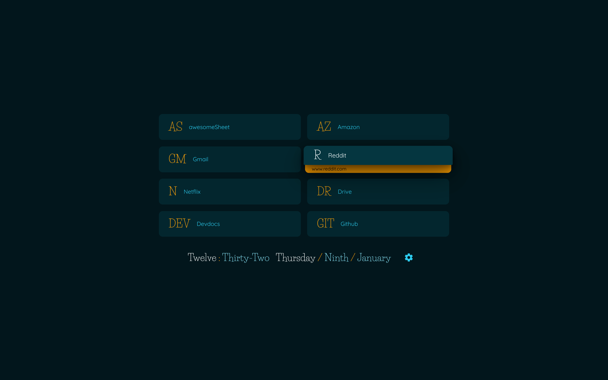](https://zombiefox.github.io/nightTab/)
[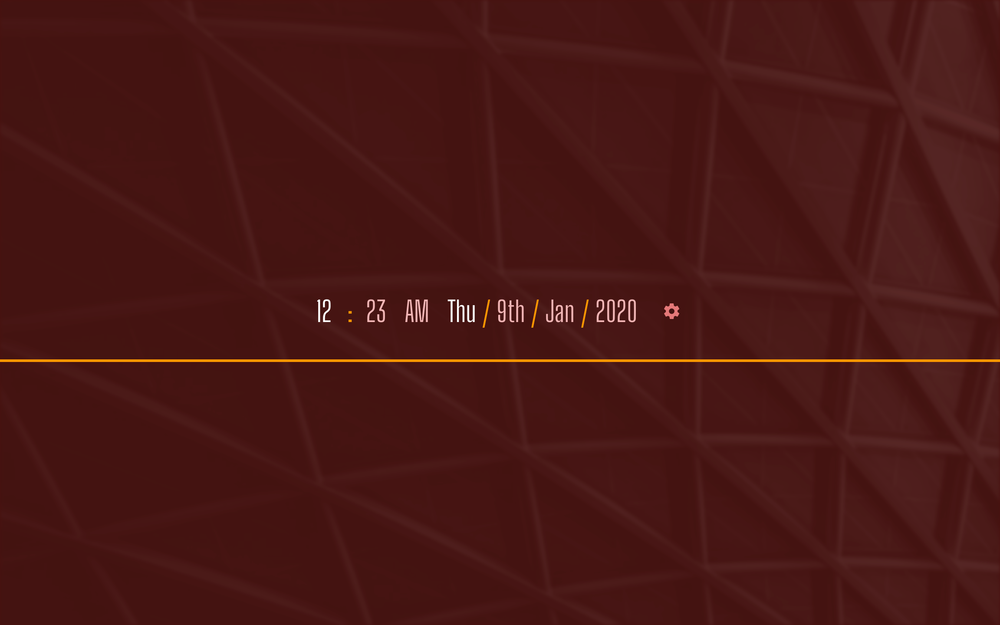](https://zombiefox.github.io/nightTab/)
[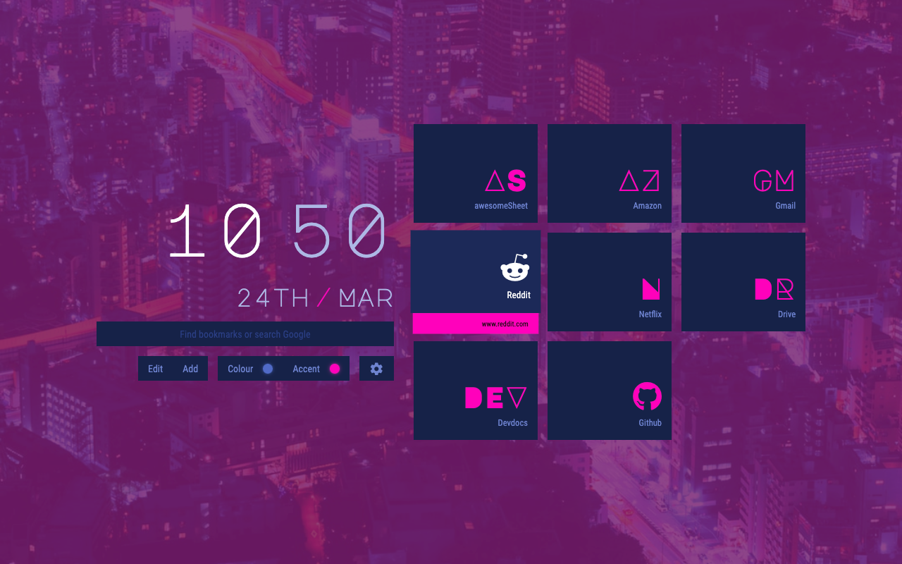](https://zombiefox.github.io/nightTab/)
[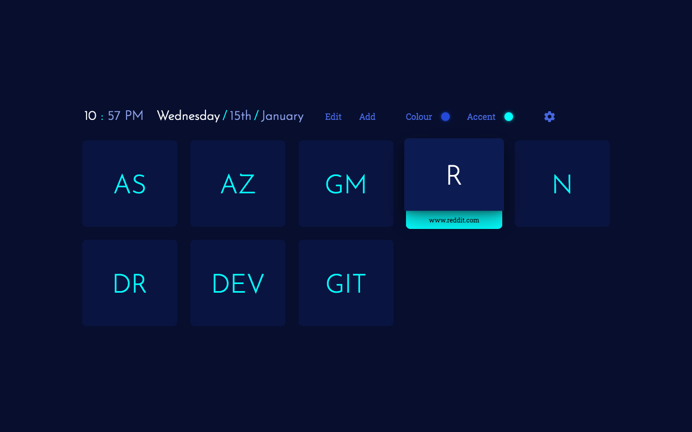](https://zombiefox.github.io/nightTab/)
[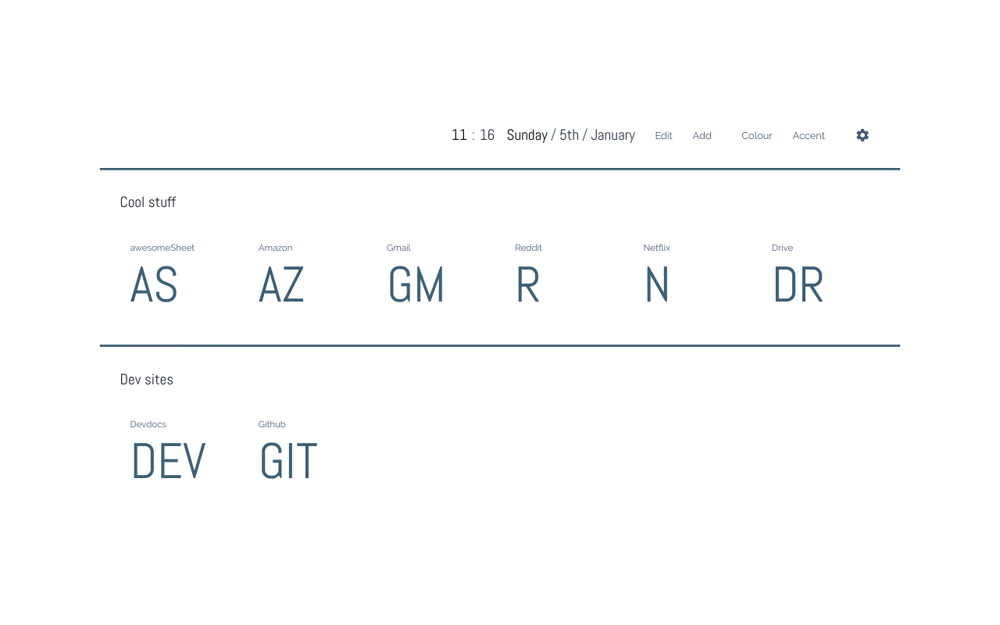](https://zombiefox.github.io/nightTab/)

[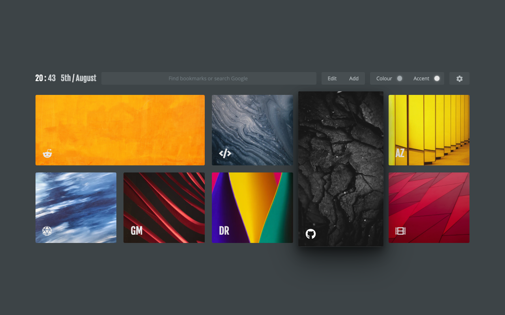](https://zombiefox.github.io/nightTab/)
[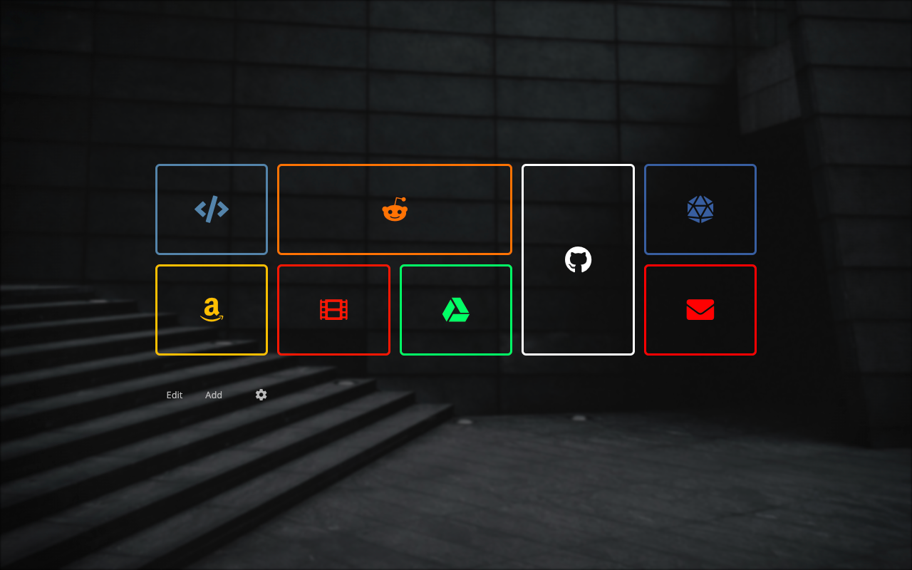](https://zombiefox.github.io/nightTab/)
