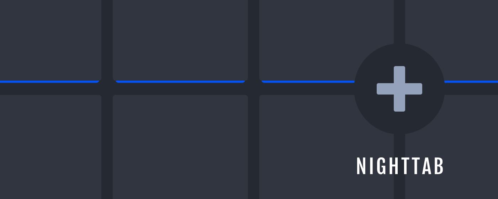
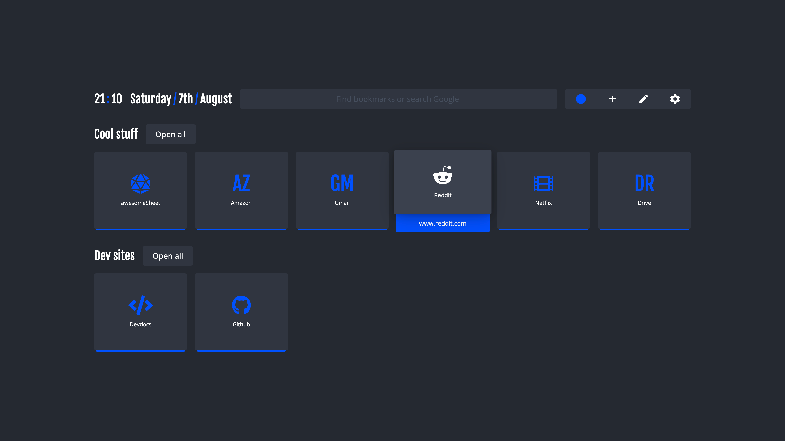
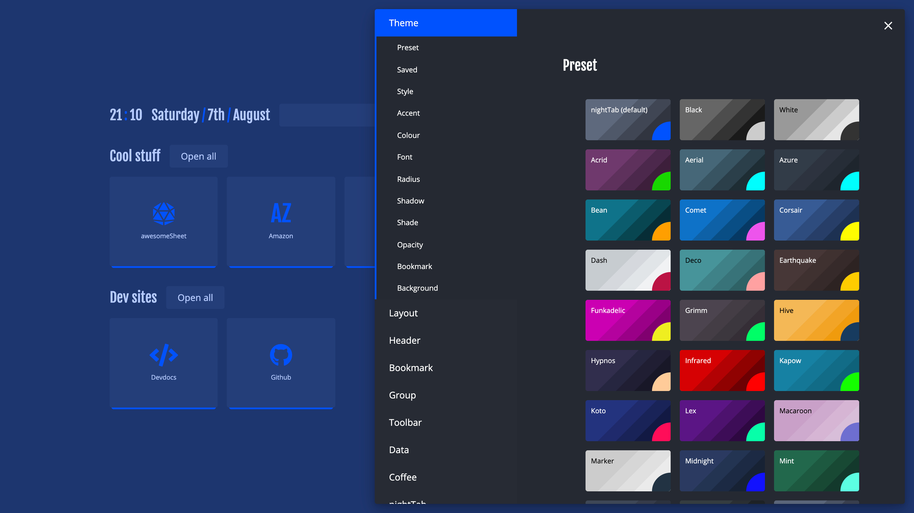
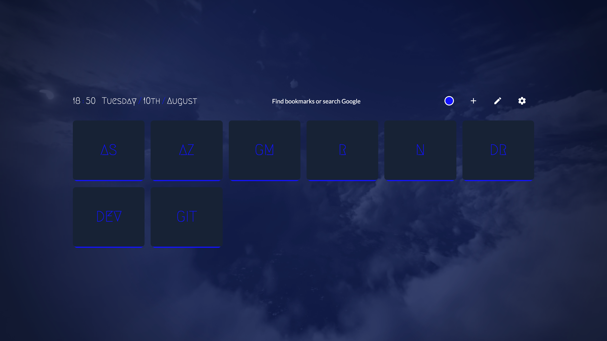
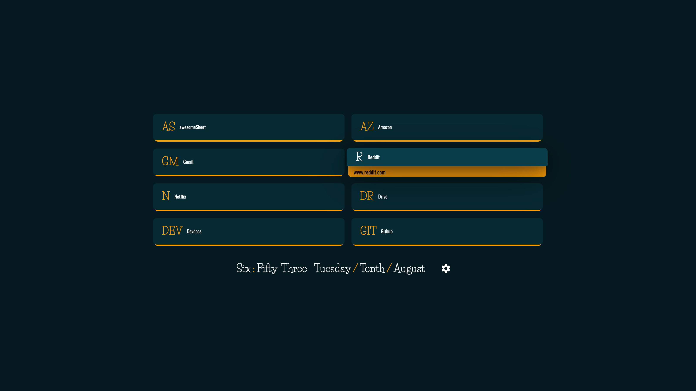
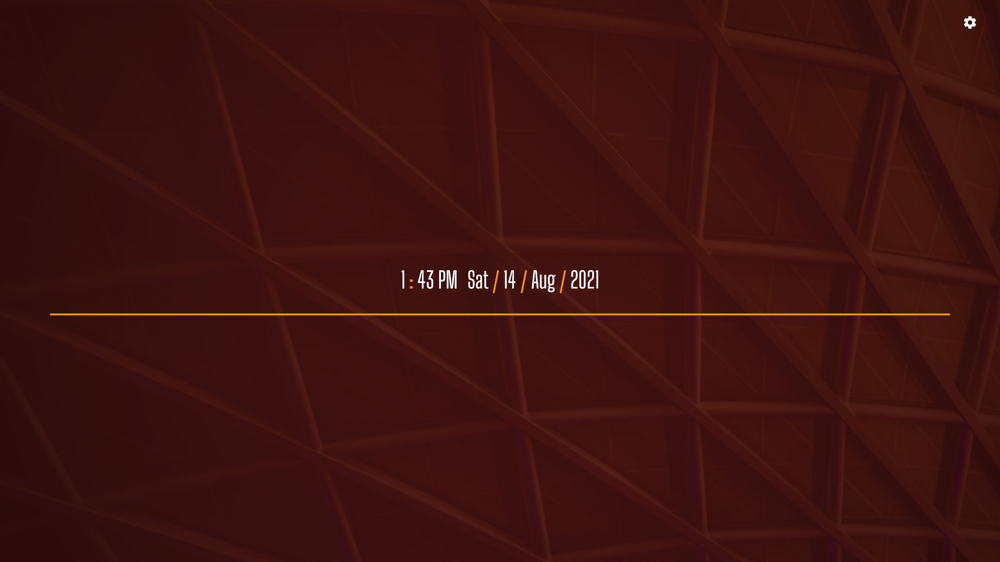
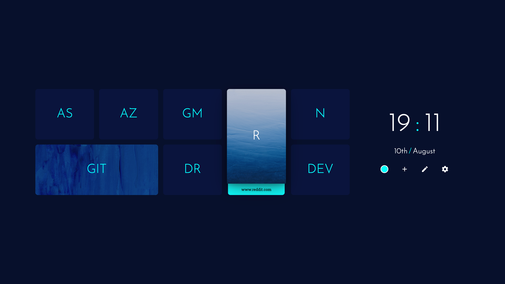
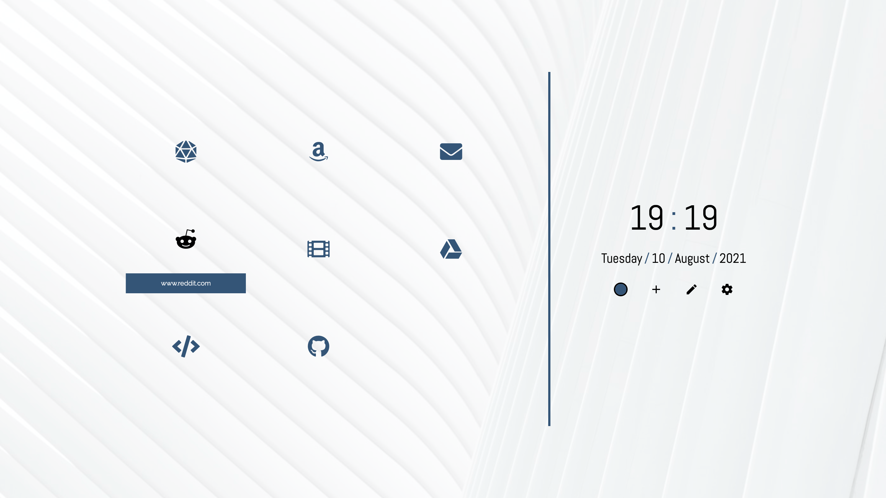
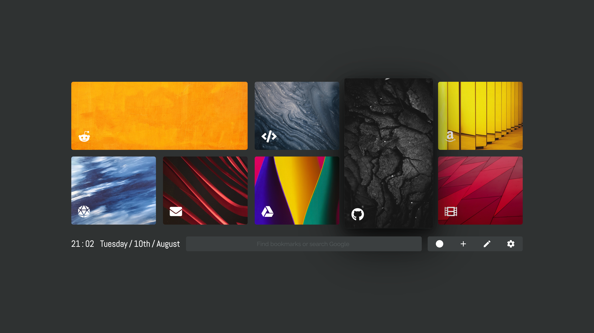

# 

A neutral new tab page accented with a chosen colour. Customise the layout, style, background and bookmarks in nightTab -- a custom start page.

| [Install nightTab Extension](https://chrome.google.com/webstore/detail/nighttab/hdpcadigjkbcpnlcpbcohpafiaefanki) | [Install nightTab Add On](https://addons.mozilla.org/en-GB/firefox/addon/nighttab/) | [Buy me a coffee](https://www.buymeacoffee.com/zombieFox/) | [Join the community](https://www.reddit.com/r/nighttab/) |
|:-------------:|:-------------:|:-------------:|:-------------:|
|  |  |  |  |

# Support

- [Project goals](https://github.com/zombieFox/nightTab/wiki/Project-goals)
- [Applying bookmark settings to all](https://github.com/zombieFox/nightTab/wiki/Applying-bookmark-settings-to-all)
- [Browser support](https://github.com/zombieFox/nightTab/wiki/Browser-support)
- [Cookies and cache](https://github.com/zombieFox/nightTab/wiki/Cookies-and-cache)
- [Data backup and restore](https://github.com/zombieFox/nightTab/wiki/Data-backup-and-restore)
- [Local background image](https://github.com/zombieFox/nightTab/wiki/Local-background-image)
- [Protected URLs](https://github.com/zombieFox/nightTab/wiki/Protected-URLs)
- [Recovering settings and bookmarks](https://github.com/zombieFox/nightTab/wiki/Recovering-settings-and-bookmarks)
- [Resetting when opening the browser](https://github.com/zombieFox/nightTab/wiki/Resetting-when-opening-the-browser)
- [Respecting your privacy](https://github.com/zombieFox/nightTab/wiki/Respecting-your-privacy)
- [Setting a background video or image](https://github.com/zombieFox/nightTab/wiki/Setting-a-background-video-or-image)
- [Setting nightTab as your Firefox homepage](https://github.com/zombieFox/nightTab/wiki/Setting-nightTab-as-your-Firefox-homepage)

# Development

When developing use:
- `npm start`

A development server will automatically open the project in your browser. Normally here: `http://localhost:8080`.

To build the project use:
- `npm run build`

A web ready folder will be created in `/dist/web/`.
A browser addon/extension ready zip will be created in `/dist/extension/`.

# Screenshots

## Example nightTab setups:

- [Where to find these setups](https://github.com/zombieFox/nightTab/tree/main/asset/screenshot)
- [How to import these setups](https://github.com/zombieFox/nightTab/wiki/Data-backup-and-restore#restore-data)

