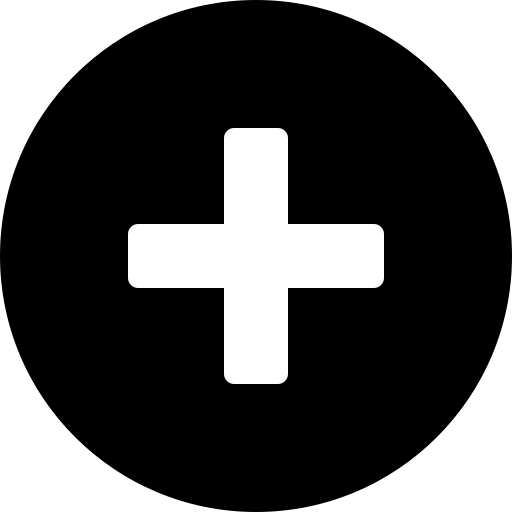

A neutral new tab page accented with a chosen colour. Customise the layout, style, background and bookmarks in nightTab -- a custom start page.

| [See the demo in action](https://zombiefox.github.io/nightTab/) | [Install nightTab Extension](https://chrome.google.com/webstore/detail/nighttab/hdpcadigjkbcpnlcpbcohpafiaefanki) | [Install nightTab Add On](https://addons.mozilla.org/en-GB/firefox/addon/nighttab/) | [Buy me a coffee](https://www.buymeacoffee.com/zombieFox/) | [Join the community](https://www.reddit.com/r/nighttab/) |
|:-------------:|:-------------:|:-------------:|:-------------:|:-------------:|
|  |  |  |  |  |

---

### Support

- [Browser support](https://github.com/zombieFox/nightTab/wiki/Browser-support)
- [Cookies and cache](https://github.com/zombieFox/nightTab/wiki/Cookies-and-cache)
- [Data backup and restore](https://github.com/zombieFox/nightTab/wiki/Data-backup-and-restore)
- [Respecting your privacy](https://github.com/zombieFox/nightTab/wiki/Respecting-your-privacy)
- [Recovering settings and bookmarks](https://github.com/zombieFox/nightTab/wiki/Recovering-settings-and-bookmarks)
- [Setting a background video or image](https://github.com/zombieFox/nightTab/wiki/Setting-a-background-video-or-image)
- [Local background image](https://github.com/zombieFox/nightTab/wiki/Local-background-image)
- [Setting nightTab as your Firefox homepage](https://github.com/zombieFox/nightTab/wiki/Setting-nightTab-as-your-Firefox-homepage)

---

### Development

When developing use:
- `npm start`

A development server will run on `http://localhost:5000/`

To build the project use:
- `npm run build`

A web ready folder will be created in `/dist/web/`.
A browser addon/extension ready zip will be created in `/dist/extension/`.

---

---

### Example nightTab setups:

- [Where to find these setups](https://github.com/zombieFox/nightTab/tree/main/asset/screenshot)
- [How to import these setups](https://github.com/zombieFox/nightTab/wiki/Data-backup-and-restore#restore-data)

